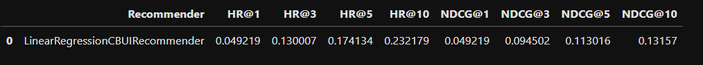
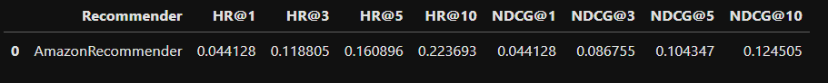

<h1>Project desciption</h1>

The project was carried out as part of the "recommender systems" class. 
The goal of the project is to create a recommender that achieves better results than amazon's recommender from a few years ago. 

The first step is data preparation. As part of the preparation, we perform operations such as aggregation and mapping. 

The next step is to prepare user features and items. In the case of describing users, I chose to describe the probability of occurrences of given features calculated from previous operations. In the case of items, it describes the occurrence of specific features using one-hot encoding. 
The extracted user and item feature descriptions are passed to the fit method, where the recommender is trained, and the recommend method where it returns the most matching recommendations. 
Of the available recommender types, I chose Linear Regression Recommender because of its speed and relatively high performance. 

Finally, tuning of the recommender and final evaluation of the results is performed. 

Data preperation can be found in data_preprocessing/data_preprocessing_toolkit.py and project_1_data_preparation.ipynb.
Preparing features and recommender training, tuning and evaluation can be found in project_1_recommender_and_evaluation.ipynb.

<h1>Score</h1>

My recommender

Amazon recommender

<h1>Used technologies</h1>

<ul>
<li>python</li>
<li>jupyter notebook</li>
<li>pandas</li>
<li>numpy</li>
<li>matplotlib</li>
<li>seaborn</li>
<li>sklearn</li>
<li>hyperopt</li>
</ul>

<h1>Local startup instruction</h1>

Make sure you have all libraries and python 3.9+ installed before starting the project.
Notebook can be started with:
<ul>
<li><code>python -m notebook</code> command executed at the project folder location</li>
<li>IDE with Jupyter plugin installed, for example Visual Studio Code</li>
</ul>
